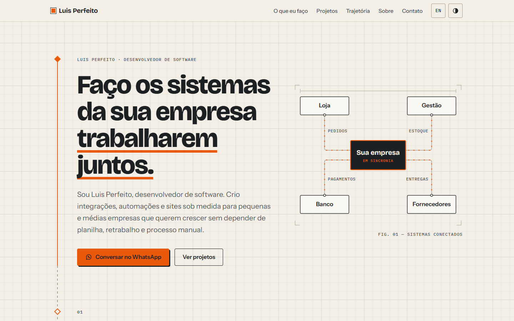
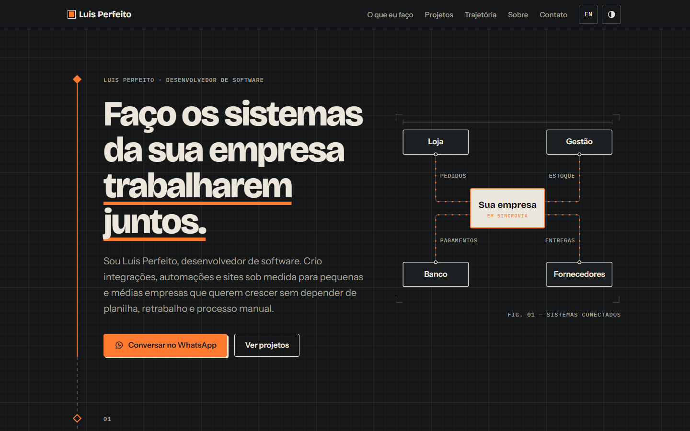
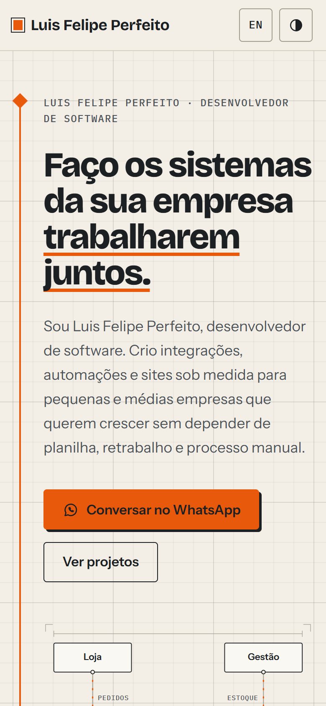

# luisperfeito.com.br

[](https://github.com/Luis-Perf/portfolio/actions/workflows/ci.yml)

Portfólio de Luis Perfeito, desenvolvedor de software. Site estático e bilíngue (PT-BR e EN), feito com Astro, sem backend e com um único script no navegador.

| Claro | Escuro |
| --- | --- |
|  |  |

<details>
<summary>Versão mobile</summary>



</details>

## Sumário

- [Visão geral](#visão-geral)
- [Stack](#stack)
- [Rodando localmente](#rodando-localmente)
- [Estrutura](#estrutura)
- [Editando o conteúdo](#editando-o-conteúdo)
- [Decisões de arquitetura](#decisões-de-arquitetura)
- [Qualidade](#qualidade)
- [Segurança](#segurança)
- [Deploy](#deploy)
- [Direitos](#direitos)

## Visão geral

O site apresenta serviços, projetos e trajetória para pequenas e médias empresas que procuram integrações, automações e sistemas web sob medida.

- Uma página inicial com serviços, forma de trabalho, projetos, trajetória, sobre e contato.
- Uma página própria para cada projeto, gerada a partir de arquivos Markdown.
- Rotas em português (`/`) e inglês (`/en/`), ligadas por `hreflang`.
- Tema claro e escuro, sem piscar ao carregar, seguindo o sistema por padrão.
- Link de WhatsApp com a saudação ajustada ao horário de quem visita, e um vCard para salvar o contato.
- Visual inspirado em planta baixa: grade técnica no fundo e um trilho que liga as seções, desenhado conforme a rolagem.

## Stack

| Área | Escolha |
| --- | --- |
| Framework | [Astro 7](https://astro.build) com TypeScript em modo strict |
| Conteúdo | Content Collections validadas com Zod |
| Estilo | CSS puro com custom properties e `light-dark()` |
| Fontes | Bricolage Grotesque, Instrument Sans e IBM Plex Mono, servidas pelo próprio site via Fontsource |
| Imagens | `astro:assets` (AVIF, WebP e JPG responsivos) |
| Qualidade | ESLint (com regras de acessibilidade), `astro check`, Lighthouse CI |
| Hospedagem | Cloudflare Pages |

## Rodando localmente

Requer Node.js 22 ou superior.

```sh
npm install
npm run dev
```

O site abre em `http://localhost:4321`.

| Script | O que faz |
| --- | --- |
| `npm run dev` | Servidor de desenvolvimento com recarga automática |
| `npm run build` | Gera o site em `dist/`, incluindo o `_headers` |
| `npm run preview` | Serve o build localmente |
| `npm run lint` | ESLint em todo o projeto |
| `npm run check` | Checagem de tipos em arquivos `.astro` e `.ts` |
| `npm run validate` | Lint, checagem de tipos e build, na ordem do CI |

## Estrutura

```text
.
├── integrations/
│   └── security-headers.ts    # gera o _headers com a CSP após o build
├── public/                    # favicon, vCard e robots.txt
└── src/
    ├── assets/                # foto (processada pelo astro:assets)
    ├── components/            # seções da página e peças reutilizáveis
    ├── config/site.ts         # nome, telefone e links
    ├── content/cases/         # projetos em Markdown, um arquivo por idioma
    │   ├── pt/
    │   └── en/
    ├── content.config.ts      # schema dos projetos
    ├── i18n/
    │   ├── ui.ts              # textos da interface em PT e EN
    │   └── routes.ts          # rotas por idioma
    ├── layouts/Base.astro     # <head>, SEO, header e footer
    ├── lib/                   # projetos e link do WhatsApp
    ├── pages/                 # só define as rotas
    ├── scripts/enhance.ts     # único JS do navegador
    ├── styles/global.css      # tokens, grade e estilos base
    └── views/                 # página inicial e página de projeto
```

## Editando o conteúdo

**Textos da interface** ficam em `src/i18n/ui.ts`. O dicionário em inglês usa o tipo do português, então uma chave que falte em um dos idiomas quebra a checagem de tipos.

**Projetos** ficam em `src/content/cases/<idioma>/<slug>.md`. O nome do arquivo vira a URL, e `translationKey` liga as duas versões:

```md
---
title: Orquestração de pagamentos
translationKey: payment-orchestration
order: 2
context: [MillionsPay, 2026–hoje]
metrics:
  - value: Centenas de milhares de reais
    label: processados nos primeiros meses
tags: [PHP, Laravel, Bun, Docker, RabbitMQ, Redis]
---

Primeiro parágrafo: aparece no card da página inicial e na meta description.

Demais parágrafos: aparecem só na página do projeto.
```

O build falha se um projeto existir em só um idioma.

## Decisões de arquitetura

**HTML estático e o mínimo de JavaScript.** O site é conteúdo, não aplicação. O único script aplica o tema escolhido e acrescenta a saudação ao link do WhatsApp. Sem ele, tudo continua funcionando: o tema segue o sistema e o link usa uma mensagem neutra.

**CSP calculada a partir do build.** A integração `security-headers` lê o HTML final, calcula o SHA-256 de cada script inline e escreve o `_headers` do Cloudflare Pages. A política nunca usa `'unsafe-inline'` e não fica desatualizada quando um script muda. A CSP do Astro não foi usada porque é entregue via `<meta>`, e `frame-ancestors` só funciona como header HTTP.

**CSS sempre externo.** Com `inlineStylesheets: 'never'`, a política fica em `style-src 'self'`. O build falha se algum atributo `style=""` aparecer no HTML.

**Uma definição por cor.** As cores usam `light-dark()`, que segue `color-scheme`. O tema é trocado mudando só essa propriedade, sem duplicar a paleta para o modo escuro.

**Animações só em CSS.** O trilho entre as seções e a entrada dos blocos usam scroll-driven animations (`animation-timeline: view()`). Navegadores sem suporte mostram o estado final, e `prefers-reduced-motion` desliga todas as animações.

**Conteúdo validado.** Cada projeto passa por um schema Zod, e os textos da interface são tipados. Um erro de conteúdo aparece no build, não em produção.

**Fontes sem deslocamento de layout.** As duas fontes principais são pré-carregadas, e cada família tem uma fonte reserva local (Arial ou Courier New, com equivalentes Liberation no Linux) ajustada com `size-adjust` e `ascent-override`, a partir de medidas feitas contra a fonte real. Com as fontes atrasadas em 2 segundos, o CLS medido fica em 0,0001.

**Sem serviços de terceiros no carregamento.** Fontes e imagens saem do próprio domínio. A única exceção prevista é o Cloudflare Web Analytics, que não usa cookies e dispensa banner de consentimento.

## Qualidade

A cada push e pull request, o [workflow de CI](.github/workflows/ci.yml) roda lint, checagem de tipos e build. Em seguida, o Lighthouse CI testa três páginas com estas metas:

| Métrica | Meta |
| --- | --- |
| Performance | ≥ 90 |
| Acessibilidade | 100 |
| Boas práticas | ≥ 95 |
| SEO | 100 |
| LCP | ≤ 2 s |
| CLS | ≤ 0,1 |
| Peso total da página | ≤ 300 KB |

Nas medições locais (desktop), as três páginas ficaram em 100 nas quatro categorias, com cerca de 195 KB. O Dependabot abre atualizações semanais de dependências e das Actions.

## Segurança

O `_headers` gerado no build aplica:

- `Content-Security-Policy` com hashes, sem `'unsafe-inline'`, e `frame-ancestors 'none'`
- `Strict-Transport-Security`
- `X-Content-Type-Options: nosniff`
- `Referrer-Policy: strict-origin-when-cross-origin`
- `Permissions-Policy` desativando câmera, microfone, geolocalização, pagamento e USB
- `Cross-Origin-Opener-Policy: same-origin`

O site não tem backend nem formulário, e o repositório não guarda segredos.

## Deploy

Cloudflare Pages, com deploy automático a cada push na `main`.

| Configuração | Valor |
| --- | --- |
| Comando de build | `npm run build` |
| Diretório de saída | `dist` |
| Node.js | 24 |

## Direitos

O código está aberto para consulta. Textos, foto e identidade visual são pessoais e não devem ser reutilizados sem autorização.
